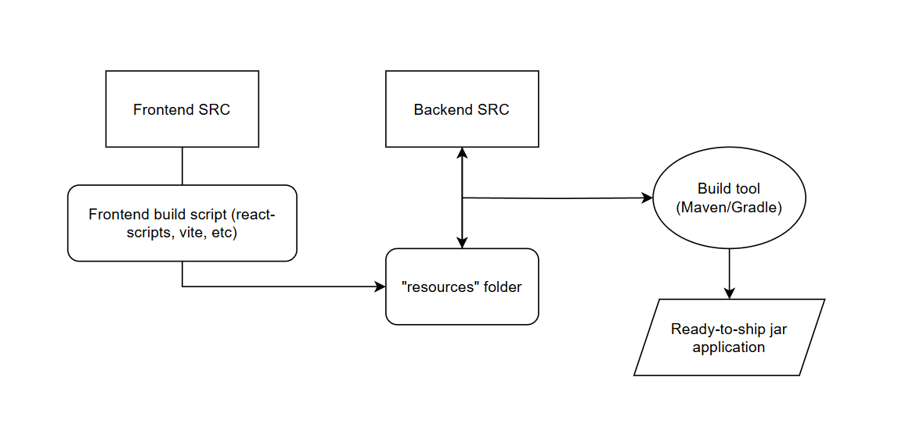

# 🌐 Fullstack Development

Fullstack development involves building both the **front-end** (user interface) and **back-end** (server logic, database) of a web application. A fullstack developer is responsible for the entire application, ensuring a smooth connection between the two layers.

Popular fullstack frameworks include:
- [Ruby on Rails](https://rubyonrails.org) (Ruby)
- [Django](https://www.djangoproject.com) (Python)
- [Laravel](https://laravel.com) (PHP)

## ⚡ Fullstack Development with Flash

Developing and packaging a fullstack application can be complex, but **Flash** simplifies the process with built-in tools and **quality-of-life features**. With Flash, you can:
- Serve both **frontend** and **backend** from a single application.
- Bundle everything into a **single JAR file** for easy deployment.
- Leverage HDI's for **clean, modular and maintainable route logic**.



## 🚀 Serving Frontend with Flash

Flash’s **dynamic file server** enables seamless fullstack development by allowing you to serve frontend assets alongside backend logic. This is made possible by the `RESOURCESTREAM` source type, which serves files from the JAR’s resources folder.

### ✅ Deployment Workflow
The recommended workflow for packaging a fullstack Flash application:
1. **Compile** the frontend application (React, Vue, Angular, etc.).
2. **Place** the compiled files inside the `resources` folder.
3. **Build** the JAR file with both frontend and backend code.
4. **Deploy** the JAR, serving both frontend and backend seamlessly.

This approach works for any frontend framework that compiles to static files, such as:
- **React** (`npm run build`)
- **Vue.js** (`npm run build`)
- **Angular** (`ng build --prod`)

## ❔ Setting up a Fullstack Flash Application

To get started with fullstack development using Flash, you will first need to choose a frontend framework and set up the build process to compile the frontend assets.
This guide will cover only some of the most popular javascript frontend build tools, but the process is similar for others.

### 🛠️ Setting up the Frontend Build Process

:::warning
When building a frontend application with a javascript framework that will be served on a subpath (e.g., `/app`), you need to specify the homepage in the `package.json` file. This ensures that the frontend assets are correctly loaded from the subpath.
Using a subpath and forgetting to set the homepage will result in broken asset links and a potentially non-functional frontend.
```json
{
    "homepage": "/your-subpath"
}
```
:::

- `Vite` : 
  ::: details Click to expand
  1. Install Vite on your project if it's not already installed or scaffold a new Vite project (follow the [official guide](https://vite.dev/guide/#scaffolding-your-first-vite-project)).
  2. Edit the `vite.config.js` or `vite.config.ts` build section to output the compiled files to the `resources/frontend` folder of your Flash project (see example below).
    ```typescript
        // ...
        import path from 'path' // [!code ++]
        export default defineConfig({
            // ...
    
            build: { // [!code ++]
                outDir: path.resolve(__dirname, '..path/to/your/src/main/resources/frontend'), // [!code ++]
                emptyOutDir: true // [!code ++]
            }, // [!code ++]
        });
    ```
  3. The output of your Vite build will be placed in the `resources/frontend` folder of your Flash project, ready to be packaged into the JAR file.
  :::

- `Parcel`
    ::: details Click to expand
    1. Install Parcel on your project if it's not already installed or scaffold a new Parcel project (follow the [official guide](https://parceljs.org/getting-started/webapp/)).
    2. Edit the Parcel build command to output the compiled files to the `resources/frontend` folder of your Flash project (see example below).
        ```json
        {
            "scripts": {
                "build": "parcel build src/index.html --out-dir ../path/to/your/src/main/resources/frontend"
            }
        }
        ```
    3. The output of your Parcel build will be placed in the `resources/frontend` folder of your Flash project, ready to be packaged into the JAR file.
    :::

### 🛜 Serve the Frontend with Flash

Once you have compiled the frontend assets and placed them in the `resources/frontend` folder, you can serve them using Flash's dynamic file server. This server will serve the frontend assets from the JAR's resources folder.
::: info
NOTE: The following example is assuming you plan to serve the frontend from the root path (`/`).
If you plan to serve the frontend from a subpath (e.g., `/app`), you will need to adjust the endpoint path accordingly by adding a trailing `/*`.
:::

```java
public class Example {
    public static void main(String[] args) {
        FlashServer server = new FlashServer(8080);

        server.serveDynamic("/*", new DynamicFileServerConfiguration(
            true,
            "frontend", // points to the resources/frontend folder
            "index.html",
            SourceType.RESOURCESTREAM
        ));
        
        server.start();
    }
}
```

### 🚀 Package and Deploy your app!

With the frontend and backend code in place, you can now build the JAR file and deploy it to your server. The JAR file will contain both the frontend and backend code, making it easy to deploy and run your fullstack application.

All you've left to do is run the jarfile on any machine that has Java installed, and your fullstack application will be up and running!


