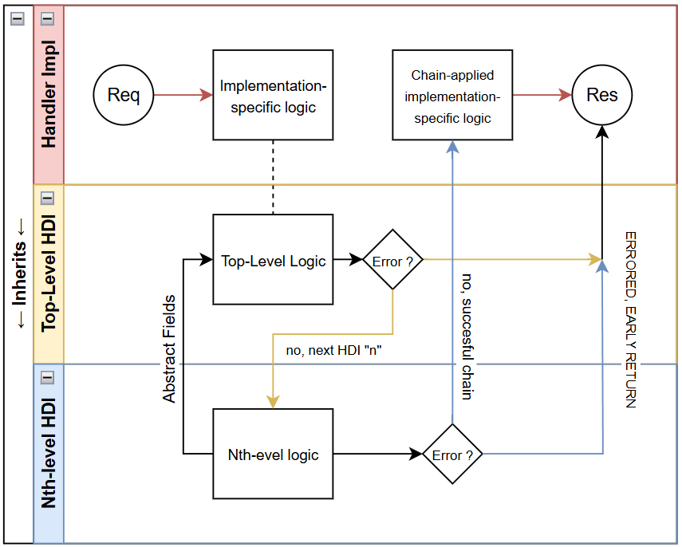

# ⚡ Handler Default Implementations (HDI)

Handler Default Implementations (HDIs) provide an elegant way to standardize common behaviors across multiple request handlers. By defining base handlers that extend `RequestHandler` (or chaining multiple base handlers together), you can modularize logic for common tasks like authentication, user data retrieval, and rate limiting.

HDIs are designed using the [Chain of Responsibility pattern](https://en.wikipedia.org/wiki/Chain-of-responsibility_pattern), making it easy to handle requests with layered logic.

## 🔗 How It Works

Instead of repeating the same logic in each handler, create abstract handler classes that define common functionality. Your handler implementations then extend these base classes, inheriting the shared behavior while implementing the request-specific logic.

### Semantics of an HDI

Creating an HDI is simple, but it's useful to follow some guidelines for clarity and maintainability:

1. ### **Base HDI Class**:
    - **Extends**: The base HDI class should extend `RequestHandler`.
    - **Constructor**: The constructor must call the super constructor with `Request` and `Response` objects.
    - **Override**: Override the `handle` method to include common behavior.
      The `handle` method should return the response to the client and should call the _Abstract Handler Method_, which is implemented by the handler or next HDI in the chain.
      ```java
      @Override
      public Object handle() {
          // Common logic here, then call the abstract method
          return handleCustom();
      }
      ```
    - **Abstract Handler Method**: Define an abstract method that must be implemented by the handler to provide custom logic. It should look like this:
      ```java
      protected abstract Object handleCustom();
      ```
    - **Protected Fields**: If needed, declare protected fields in the base class to pass data between handlers in the chain.
      ::: info
      Protected fields are accessible to the handler implementation inside the Abstract Handler Method.
      Example HDI :
         ```java
         public abstract class MyHDI extends RequestHandler {
             protected String data; 
             public BaseHandler(Request req, Response res) {
                 super(req, res);
             }
             @Override
             public Object handle() {
                 data = "Some data"; // Set the data
                 return handleCustom();
             }
             protected abstract Object handleCustom();
         }
         ```

      Example Handler Implementation :

         ```java
         public class MyHandler extends MyHDI {
             public MyHandler(Request req, Response res) {
                 super(req, res);
             }
             @Override
             protected Object handleCustom() {
                 // The data is accessible here
                 System.out.println(data);
                 return "Response";
             }
         }
         ```
      :::

2. ### **Handler Implementation**:
    - **Extends**: The handler should extend the HDI class (or be the final handler in the chain).
    - **Constructor**: The constructor should call the super constructor with `Request` and `Response` objects.
    - **Implement**: Implement the **Abstract Handler Method** from the HDI.
    - **Response Logic**: The response logic should be in the abstract method, and its return value is sent to the client.
      ```java
      @Override
      protected Object handleCustom() {
            // Custom logic here
            return "Response";
      }
      ```
    - **Protected Fields**: The handler implementation can access data from the HDI using the protected fields, **inside** the Abstract Handler Method.

### 🛠 Example: API Key Authentication

Now let's go over a simple example to demonstrate how HDIs work. Imagine you need to authenticate API requests by checking an API key. You can create an abstract `APIKeyProtectedHandler` that extends `RequestHandler` and handles the API key authentication:

```java
public abstract class APIKeyProtectedHandler extends RequestHandler {
    protected String apiKey;

    public APIKeyProtectedHandler(Request req, Response res) {
        super(req, res);
    }

    @Override
    public Object handle() {
        apiKey = req.header("X-API-Key");

        if (apiKey == null || !isValidApiKey(apiKey)) {
            res.status(403);
            res.type("application/json");
            return "{\"error\":\"Invalid API Key\"}";
        }

        return handleAuthorized();
    }

    protected abstract Object handleAuthorized();

    private boolean isValidApiKey(String key) {
        // Implement key validation logic, e.g., checking against a database
        return true;
    }
}
```

Now, your API handler implementation only need to extend APIKeyProtectedHandler, ensuring every request has a valid API key before executing its logic:

```java
@RouteInfo(endpoint = "/data", method = HttpMethod.GET)
public class GetDataHandler extends APIKeyProtectedHandler {
    public GetDataHandler(Request req, Response res) {
        super(req, res);
    }

    @Override
    protected Object handleAuthorized() {
        res.type("application/json");
        return "{\"data\":\"Your API response here\"}";
    }
}
```

## 🏗️ Chaining HDIs for Modular Logic



HDIs can be chained together to create multiple layers of logic. For example, if you need to authenticate a user and fetch their data from a database, you can create two HDIs:

- `ProtectedHandler` ensures authentication.

```java
public abstract class ProtectedHandler extends RequestHandler {
    protected String authToken;

    public ProtectedHandler(Request req, Response res) {
        super(req, res);
    }

    @Override
    public Object handle() {
        authToken = req.header("Authorization");
        if (authToken == null || !isValidToken(authToken)) {
            res.status(401);
            res.type("application/json");
            return "{\"error\":\"Unauthorized\"}";
        }
        return handleAuthenticated();
    }

    protected abstract Object handleAuthenticated();
}
```

- `AuthenticatedHandler` extends ProtectedHandler to fetch user data from the database, and overrides `handleAuthenticated` to ensure the user is authenticated before proceeding.

```java
public abstract class AuthenticatedHandler extends ProtectedHandler {
    protected User user;
    private String authToken; // inherited from ProtectedHandler

    public AuthenticatedHandler(Request req, Response res) {
        super(req, res);
    }

    @Override
    protected Object handleAuthenticated() {
        user = getUserFromDatabase(authToken);
        if (user == null) {
            res.status(403);
            res.type("application/json");
            return "{\"error\":\"User not found\"}";
        }
        return handleWithUser();
    }

    protected abstract Object handleWithUser();
}
```

- Your handler implementation `UserProfileHandler` extends `AuthenticatedHandler` and implements `handleWithUser` to ensure the user is authenticated and their profile data has been fetched before proceeding.

```java
@RouteInfo(endpoint = "/profile", method = HttpMethod.GET)
public class UserProfileHandler extends AuthenticatedHandler {
    public UserProfileHandler(Request req, Response res) {
        super(req, res);
    }

    @Override
    protected Object handleWithUser() {
        res.type("application/json");
        return "{\"username\":\"" + user.getUsername() + "\"}";
    }
}
```