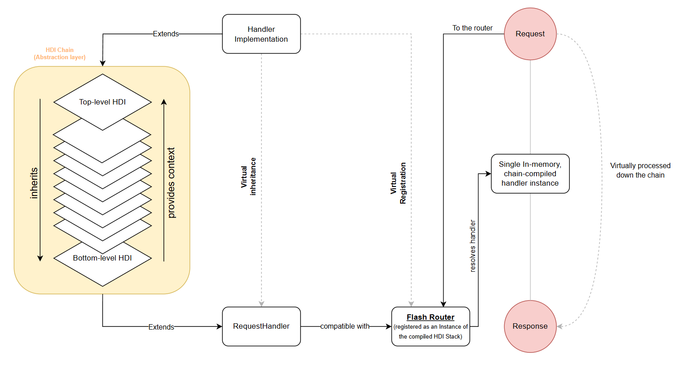

# ⚡ Handler Default Implementations (HDI)

Handler Default Implementations (HDIs) offer a streamlined approach to standardize common behaviors across request handlers in Flash.
By extending a base `RequestHandler` (or chaining multiple base handlers), you can centralize tasks like authentication, user data retrieval,
and rate limiting while keeping your code modular and maintainable.

HDIs use the [Chain of Responsibility pattern](https://en.wikipedia.org/wiki/Chain-of-responsibility_pattern) to layer reusable logic,
ensuring that shared functionality is defined once and inherited by all handlers.



## 🔗 How HDIs Work

Rather than repeating common logic across different handlers, HDIs allow you to create **abstract base handlers** that encapsulate shared behaviors. When your individual request handlers extend these bases, they automatically inherit predefined functionality, and you only need to implement request-specific logic.

### Key Benefits

- **Build-Time Optimization:**  
  When your project is compiled, Flash’s router merges the entire HDI chain into a single handler instance.
  This eliminates extra function calls and runtime lookups, resulting in a leaner execution path compared to traditional middleware stacks.

- **Reduced Complexity:**  
  Unlike frameworks that rely on reflection (e.g., Spring Boot) or a deep middleware stack (e.g., Express.js),
  HDIs embed inherited behavior directly in the compiled class, minimizing runtime overhead.

- **Type Safety & Clean State Management:**  
  Protected fields in HDIs allow seamless data sharing between handlers without using global variables, callbacks, or type casting.
  Note: Always declare these fields as instance (non-static) variables to ensure each handler maintains its own state.

## 🛡️ HDI Design Guidelines

### 1. Base HDI Class

Define an abstract base class that extends `RequestHandler` to encapsulate common logic:

- **Constructor:**  
  Initialize by passing `Request` and `Response` objects to the superclass.

- **Overridden `handle` Method:**  
  Implement common logic and delegate to an abstract method for custom behavior.

  ```java
  @Override
  public Object handle() {
      // Insert common logic here (e.g., logging, header processing)
      return handleCustom();
  }
  ```

- **Abstract Method:**  
  Declare an abstract method that must be implemented by subclasses.

  ```java
  protected abstract Object handleCustom();
  ```

- **Protected Fields:**  
  Use protected instance fields to share data between HDI layers.

  > **Warning:** Do **not** declare these fields as static. Each handler should manage its own state.
  >
  > ```java
  > // Incorrect: static field
  > protected static String data;
  > 
  > // Correct: instance field
  > protected String data;
  > ```

### 2. Concrete Handler Implementation

Extend the base HDI class in your handler:

- **Constructor:**  
  Call the super constructor with the necessary `Request` and `Response` objects.

- **Implement `handleCustom()`:**  
  Write the request-specific logic here. Protected fields from the base class are available within this method.

  ```java
  @Override
  protected Object handleCustom() {
      // Custom logic using inherited data
      return "Response";
  }
  ```

## 🛠️ Example: API Key Authentication

This example demonstrates how to build an HDI that validates an API key before processing a request.

### Abstract API Key Protected Handler

```java
public abstract class APIKeyProtectedHandler extends RequestHandler {
    protected String apiKey;

    public APIKeyProtectedHandler(Request req, Response res) {
        super(req, res);
    }

    @Override
    public Object handle() {
        apiKey = req.header("X-API-Key");
        if (apiKey == null || !isValidApiKey(apiKey)) {
            res.status(403);
            res.type("application/json");
            return "{\"error\":\"Invalid API Key\"}";
        }
        return handleAuthorized();
    }

    protected abstract Object handleAuthorized();

    private boolean isValidApiKey(String key) {
        // Implement your API key validation logic here
        return true;
    }
}
```

### Concrete API Handler

Extend the abstract handler to process the request only if the API key is valid:

```java
@RouteInfo(endpoint = "/data", method = HttpMethod.GET)
public class GetDataHandler extends APIKeyProtectedHandler {
    public GetDataHandler(Request req, Response res) {
        super(req, res);
    }

    @Override
    protected Object handleAuthorized() {
        res.type("application/json");
        return "{\"data\":\"Your API response here\"}";
    }
}
```

## 🏗️ Chaining HDIs for Modular Logic

HDIs can be layered to build complex flows. For instance, you might first authenticate a request, then fetch user data.

### Protected Handler (Authentication)

```java
public abstract class ProtectedHandler extends RequestHandler {
    protected String authToken;

    public ProtectedHandler(Request req, Response res) {
        super(req, res);
    }

    @Override
    public Object handle() {
        authToken = req.header("Authorization");
        if (authToken == null || !isValidToken(authToken)) {
            res.status(401);
            res.type("application/json");
            return "{\"error\":\"Unauthorized\"}";
        }
        return handleAuthenticated();
    }

    protected abstract Object handleAuthenticated();

    private boolean isValidToken(String token) {
        // Validate the token here
        return true;
    }
}
```

### Authenticated Handler (User Data Retrieval)

Extend the `ProtectedHandler` to fetch user details:

```java
public abstract class AuthenticatedHandler extends ProtectedHandler {
    protected User user;

    public AuthenticatedHandler(Request req, Response res) {
        super(req, res);
    }

    @Override
    protected Object handleAuthenticated() {
        user = getUserFromDatabase(authToken);
        if (user == null) {
            res.status(403);
            res.type("application/json");
            return "{\"error\":\"User not found\"}";
        }
        return handleWithUser();
    }

    protected abstract Object handleWithUser();
}
```

### Final Handler Implementation

Implement the final handler that uses the authenticated user data:

```java
@RouteInfo(endpoint = "/profile", method = HttpMethod.GET)
public class UserProfileHandler extends AuthenticatedHandler {
    public UserProfileHandler(Request req, Response res) {
        super(req, res);
    }

    @Override
    protected Object handleWithUser() {
        res.type("application/json");
        return "{\"username\":\"" + user.getUsername() + "\"}";
    }
}
```

---

For reference, here's a visual representation of how an HDI chain operates: <br>


