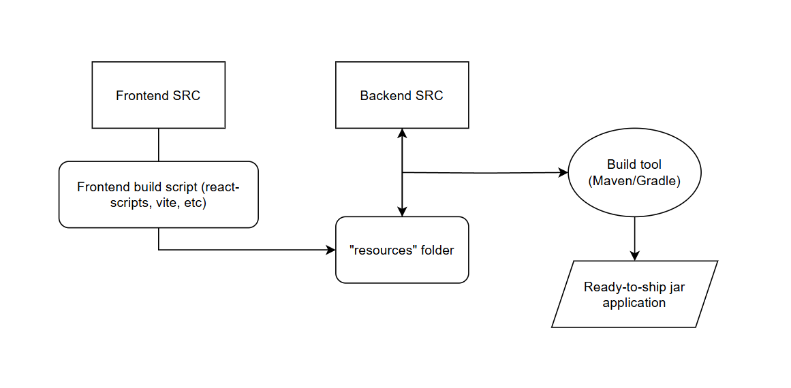

# 📁 Dynamic File Server

Sometimes we need to serve files in a dynamic context, in this sense a static file server is limiting.
Imagine we have a frontend application that is compiled down to a single `index.html` file, and we want to serve it with Flash
alongside it's javascript and css bundles. The way these compiled applications work is that they rely heavily on
client-side routing, so when the user navigates to a different page, the frontend application will try to fetch the
corresponding file from the server. This is where a dynamic file server comes in handy, as no route is pre-registered.

::: warning
The dynamic file server relies heavily on the concept of dynamic handlers, which are handlers that will resolve for
any subpath of the endpoint they are registered to (see [Handler Types](/flash/dynamic-handlers) for more info).
:::

## Usage

To serve static files in Flash, you need to call the `server.serveDynamic()` method with the endpoint path and an instance of `DynamicFileServerConfig`.
The configuration object is instanced like so :

```java
DynamicFileServerConfiguration(
    boolean enableFileWatcher,
    String destinationPath,
    String dynamicEntrypoint,
    SourceType sourceType
)
```

- `enableFileWatcher` : If set to `true`, the server will watch for changes in the served files and reload them automatically.
- `destinationPath` : The path to the directory containing the files to be served.
- `dynamicEntrypoint` : The path to the file that will be served when the client navigates to the endpoint eg. `index.html`.
- `sourceType` : The type of source to serve files from. It can be either `FILESYSTEM` or `RESOURCESTREAM`.

Registering the dynamic file server is as simple as calling the `server.serveDynamic()` method with the desired path and configuration object:

```java
public class Example {
    public static void main(String[] args) {
        FlashServer server = new FlashServer(8080);

        server.serveDynamic("/*", new DynamicFileServerConfiguration(
            true,
            "path/to/my/files",
            "index.html",
            SourceType.FILESYSTEM
        ));
    }
}
```

Now you can access the files (or frontend) in the specified directory by navigating to `http://localhost:8080/<file-name>`.

Similarly, you can serve the same content from the jar's resources folder by setting the `sourceType` to `RESOURCESTREAM`:

```java
public class Example {
    public static void main(String[] args) {
        FlashServer server = new FlashServer(8080);

        server.serveStatic("/static", new DynamicFileServerConfiguration(
            true,
            "path/to/my/files",
            "index.html",
            SourceType.RESOURCESTREAM
        ));
    }
}
```

## 💻 Note on Fullstack Development



The dynamic file server opens up the possibility for fullstack development with Flash.
You can easily serve your frontend application alongside your backend, and build the entire application in a single jarfile.

This is possible thanks to the `RESOURCESTREAM` source type, which allows you to serve files from the jar's resources folder:
the ideal cycle for packaging your app would be to compile the frontend application and place the compiled files in the resources folder (or setup the build script to do it for you),
then build the jarfile with the compiled frontend and the backend code.

This approach works for any frontend framework that can compile down to static files (React, Angular, Vue, etc.).

For more in-depth information on how to build a fullstack application with Flash, check out the [Fullstack Development](/flash/fullstack-development) guide.

